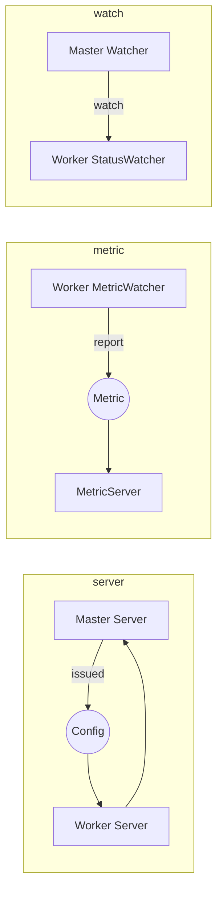
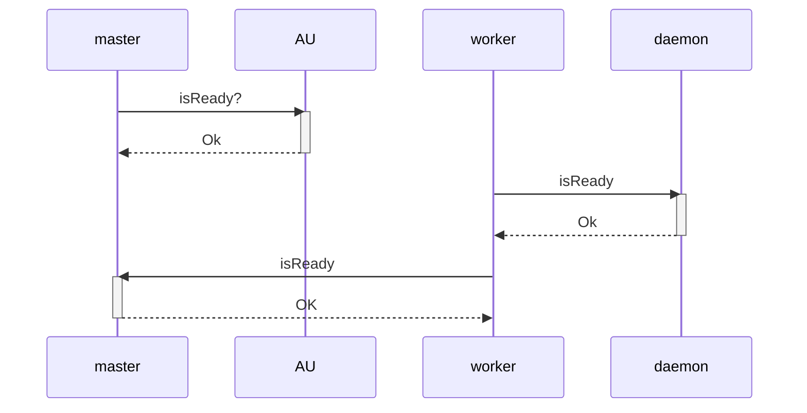
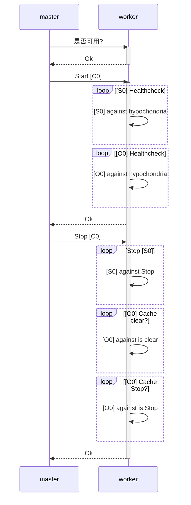
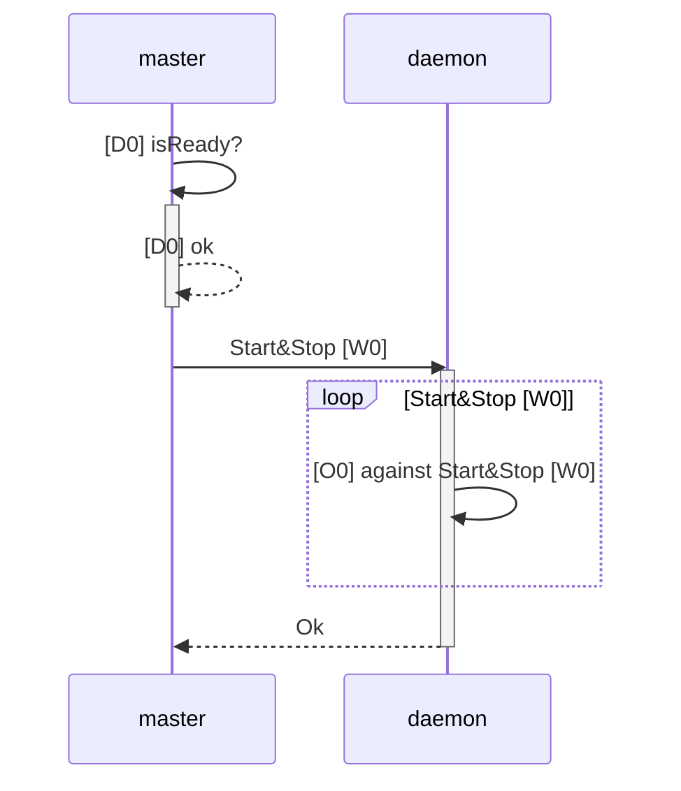

[TOC]
# sage-bigdata-etl设计文档
    - 基于AKKA 2.4.7 实现;
    - Master使用了akka-cluster与akka-http;
    - worker使用akka-remote;
# 1. 通信机制


    系统设计基于akka-actor实现,所有的通信基于消息传递;

    master 使用cluster 模式;启动后会创建与worker通信的Server,收取数据采集进度的metricServer,与监控worker的Watcher;
    worker 使用remote 模式;启动后会创建与master通信的Server,上报metric 的 MetricWatcher,及数据源状态管理的StatusWatcher


# 2. 生命周期
## 2.1 配置
    1. 配置 登录授权服务[AU];
    2. 配置 master 集群[MC];
    3. 配置 worker daemon服务[D0];
    4. 配置 worker 服务[W0],安装插件等;
## 2.2 启动


    1. 登录授权服务[AU1]启动;
    2. master集群[MC]启动,监听19091端口/ http&https 服务到 19090&19433,连接到授权服务[AU1];
    3. worker daemon服务[D*]启动;
    4. worker[Wx]启动,根据配置决定是否连接daemon 服务[Dx],连接master集群[MC],上报自己的信息;
## 2.3 配置数据处理规则    
    1. 通过UI&API 配置数据源[S0];
    2. 通过UI&API 配置解析规则[P0];
    3. 通过UI&API 配置分析,聚合规则[H0];
    4. 通过UI&API 配置数据输出[O0];
    5. 通过UI&API 配置组合数据处理通道[C0];
## 2.4 启动&运行 数据处理流程



    1. 选定处理通道[C0]使用服务[W0];
    2. 启动&检查[W0]是否可用,检查[S0]是可用,检查[O0] 是否可用;
    3. 运行
    4. 停止& 停止[S0],停止P0,停止[H0],检查[O0]缓存处理完成,停止[O0],记录处理进度信息[Pin0],停止[C0];
## 2.5 远端管理worker


    1. 对于使用daemon[Dx] 启动的worker[Wx];****
    2. 可以通过UI&API 启动,停止,重启;
    3. 启动& 检查[Dx]是否可用,调用[Dx] 启动[Wx];
    4. 停止& 检查[W0]上的[C*]是否都正确处理完成,关闭[C*],停止[W0];   
## 2.6 停止    
    1. 停止worker会执行3.5 所示的检查操作
    2. 其他服务停止,会向master 发送服务终止信息;
    3. master 停止会触发集群重新选举操作;
# 3. MASTER

## 3.1 HA

​   1. master(ha) 底层使用akka cluster;
   ```yaml
    akka.remote.netty {
      tcp.hostname = 127.0.0.1
      tcp.port = 19091
    }
    akka.cluster.seed-nodes = [
      "akka.tcp://master@127.0.0.1:19091",
      "akka.tcp://master@127.0.0.1:19092"
      ]
   ```
2.    实现ClusterListener来互相监听master-node的启停;
     Master.brothers HA的各个服务节点信息 

3. 实现BroadcastServer 来同步消息,存储等到各个node;
      ```scala
         def receive: Receive = {
            /* case Result(_, message) =>
               logger.debug(s" ignore  result:$message")*/
            case (Opt.SYNC, msg) =>
              logger.debug(s" ignore sync result:$msg")
            case msg =>
              broadcast(msg: Any)
          }
        
          def broadcast(msg: Any, response: String = "received"): Unit = {
            Master.brothers.foreach(brother => {
              val path = remotePath(brother)
              println(brother.address)
              logger.debug(s"self:${self.path} broadcast to :${brother.address}")
              context.actorSelection(path) ! msg
            })
            self.forward((Opt.SYNC, msg))
        
          }
      ```
      
## 3.2 HTTP&HTTPS REST
1.    master http&https 基于akka-http实现;
      ```scala
      val web = Http(context)
      val r = route()
      Constants.MASTER.getString("web.https.enable") match {
          case "on" =>
            val host = Constants.MASTER.getString("web.https.host")
            val port = Constants.MASTER.getInt("web.https.port")
            web.bindAndHandle(r, host, port, connectionContext = ConnectionContext.https(sslContext))

            logger.debug(s"Server(https) online at https://$host:$port/ui/index.html")
          case _ =>
        }
      Constants.MASTER.getString("web.http.enable") match {
          case "on" =>
            val host = Constants.MASTER.getString("web.http.host")
            val port = Constants.MASTER.getInt("web.http.port")
            web.bindAndHandle(r, host, port.toInt)
            logger.debug(s"Server(http) online at http://$host:$port/ui/index.html")
          case _ =>
        }
      ```
2. 继承Router 接口,Router 组合各个API 实现,并简单实现鉴权服务:
      
## 3.3 Service&Store
1.    参考 3.1 HA 章节,所有的服务和存储都实现了 BroadcastServer;
   2. 服务都包含一个存储 接口,实现基础的增删改查;
        >备注:需要保存的的操作放到 (Opt.SYNC,msg) 消息下实现,否者 直接实现
      ```scala
        trait StoreServer[T >: Null, ID] extends BroadcastServer {
        
        
          protected def store: BaseStore[T, ID]
        
          override def receive: Receive = {
            case (Opt.SYNC, (Opt.UPDATE, data: T@unchecked)) =>
              sender() ! store.set(data)
            case (Opt.SYNC, (Opt.CREATE, data: T@unchecked)) =>
              sender() ! store.set(data)
            case (Opt.SYNC, (Opt.DELETE, id: ID@unchecked)) =>
              sender() ! store.delete(id)
            case (Opt.GET, id: ID@unchecked) =>
              sender() ! store.get(id)
            case Opt.GET =>
              sender() ! store.all()
            case (start: Int, limit: Int, orderBy: Option[String@unchecked], order: Option[String@unchecked], sample: Option[T@unchecked]) =>
              logger.debug(s"query:$sample")
              sender() ! store.queryByPage(start, limit, orderBy, order, sample)
            case obj =>
              super.receive(obj)
          }
        }
      ```
   3. 存储都继承自BaseStore 在直接子类DBStore提供基本的增删改查实现,具体的放子类实现;  
      
## 3.4 Server
   Server 负责与worker通过rpc交互,启动信息,等
## 3.5 Watcher
   worker启动后上报自己的信息到masters,master server 转发worker的信息给watcher 监听worker的运行状态
## 3.6 MetricServer
   worker 汇总数据源的metric 信息上报给master的MetricServer,MetricServer存储metric信息(默认保存24小时)
# 4. Worker
## 4.1 interaction with master
   1. worker启动先检查是否启动daemon,如果配置了,检查可用性,loop 连接daemon;
   2. 检查master是否可用,loop 连接master;
   3. 启动metric上报服务,启动数据分发(publisher)服务,启动位置信息记录(position)服务;
   4. 启动自身主服务,上报自己的信息,安装的插件,支持的数据源,解析规则等;
   5. 检查本地数据源(channel)停止前的状态,恢复数据源(channel)的运行状态;
   6. 等待master管理,数据源配置下发等;
## 4.2 core processor 生命周期;
  1.  当收到master的启动命令后,worker server 根据config 生成Processor;
  2.  Processor 创建Monitor  监听源的变化;
  3.  Processor 创建Writer 等待数据输出;
  4.  Monitor 发现新的源到来,生成Reader 转发给Processor;
  5.  loop [4];
  6.  Processor 为Reader 生成一个executor 来处理这个源;
  7.  executor 根据Reader 及config 创建lexers;
  8.  lexer 请求execute 数据 ;
  9.  lexer 获取execute 返回数据 解析;
  10.  lexer 解析发送给writers;
  11.  loop [8];
  12.  writer 保存数据;
  13.  writer 报告[executor]批次处理完成;
  14.  loop [12];
     
## 4.3 Monitor
1.    monitor 启动后根据数据源配置,监听源的状态变化;
   2. 根据变换生成Reader 传回给Processor;
   3. 需要实现如下接口
   ```scala
    def run(): Unit
   ```


## 4.4 Reader
1.    Reader 继承自Iterable 实现closable 接口,提供直接获取数据take接口;
   2. Reader 包装了Stream 子类,提供具体的数据获取方法;
   3. 需要实现如下接口
   ```scala
     def path: String
     
     val stream: Stream[T]
   ```
## 4.5 Parser
1.    具体日志的解构方法,对应的实现是Lexer;
   2. 接口
       ```scala
          trait Lexer[F, T] extends Serializable with Logger {
          
            @throws(classOf[CollectorException])
            def parse(from: F): T
          }
       ```
   3. 可以考虑默认继承 DefaultLexer[F, T <: Map[String, Any]] 
## 4.6 Filter
1.    Filter 是对Parser的补充操作,提共对解析完整的数据的进一步处理;
   2. 接口
   ```scala
        @JsonIgnoreProperties(Array("_field", "_name"))
      abstract class Rule(val name: String) extends Serializable {
      
        def process(event: Map[String, Any]): Map[String, Any]
      
      }
   ```
   3.  Filter 都继承自Rule,实现对应的 process 方法即可
## 4.7  数据分析(Handler) 
1.    连接流计算的处理规则引擎;
   2. 接口
   ```scala
        trait StreamHandler[CONF <: Handler, F, T] extends Serializable with Logger {
        
          def conf: CONF
        
          def handle(data: F): T
        
        }
   ```
## 4.8 Writer
1.    数据存储的实现;
   2. 接口
   ```scala
        @throws(classOf[LogWriteException])
       def write(t: T): Unit
     
     
       def redo(): Unit
     
       def tail(num: Int): Unit
   ```
## 4.9 Timer
   1. 简单的数据流(channel)调度功能;
# 5. 公共接口
   1. com.haima.sage.bigdata.etl.monitor.Monitor;
     实现call  方法监听数据源,调用父类send方法生成Reader;
   ```scala
    def call(): Void
    def send(reader: Option[LogReader[_]], parser: Option[Parser]): Unit
   ```
   2. com.haima.sage.bigdata.etl.common.base.LogReader[T];
      需要实现跳过数据(skip),源路径(path),具体处理流(stream),对于一个流可以调用wrap,使用一个包装类,来丰富已经有的,需要特异化处理的数据
      ```scala
            def skip(skip: Long): Long
          
            def path: String
          
            val stream: Stream[T]
          
            def wrap(codec: Option[Codec], stream: Stream[T]): Stream[T]
      ```
      >对于一些需要系统来保证数据一致性的可以考虑实现位置信息的方法
      >```scala
      >trait Position {
      >   def position: ReadPosition
      > 
      >   def callback(batch: ReadPosition)(implicit positionServer: ActorSelection): Unit = {
      >     positionServer ! (Opt.PUT, batch)
      >   }
      > }
      >```

   3. com.haima.sage.bigdata.etl.common.base.LogWriter
    需要实现写数据(write),重做(redo),收尾(tail),刷新(flush)
   ```scala
      def write(t: T): Unit
    
      def redo(): Unit
    
      def tail(num: Int): Unit
      
      def flush():Unit
   ```
   4. 驱动Driver
         ```scala
          trait Driver[T] {
            val mate: DriverMate
          
            def driver(): Try[T]
          }
         ```
   5. 可用性检查
         ```scala
          trait UsabilityChecker {
            def mate: DriverMate
          
            protected def msg:String
            def check: Usability
          }
         ```
### 6. 数据(补充,丰富化)接口
   实现方式:
        
   1.加载到采集器,读取
   2. 加载部分到缓存,根据命中重新获取
    
   ```scala
       trait KnowledgeLoader[D <: DataSource, T] {
       
         def source: D
       
         /**
           *
           * @return 数据
           */
         def load(): Iterable[T]
       
         /**
           * 分页数据大小
           *
           * @return (数据,是否还有)
           */
         def byPage(size: Int): (Iterable[T], Boolean)
       }
   ```
   
   3. 知识库使用
   ```scala
      trait KnowledgeUser {
      
        def table: String
      
      
        /** 获取需要补足的数据,根据字段的具体值 */
        def get(key: String, value: Any): Option[Map[String, Any]]
      
        /** 获取需要补足的数据,根据字段的具体值 */
        def byScript(event: Map[String, Any], script: String): Map[String, Any]
      
      
      }
   ```
   ```mermaid
      graph LR
          	KnowledgeLoader---|1:1|NODE
              KnowledgeStore ---|1:1|NODE
      		KnowledgeUser ---|1:N|NODE
              KnowledgeLoader ---|loader knowledge|KnowledgeLoader
              KnowledgeLoader ---|save to|KnowledgeStore
              KnowledgeUser ---|direct use  |KnowledgeStore
              KnowledgeUser ---|sync knowledge from|KnowledgeStore 
              Lexer ---|use|KnowledgeUser
   ```
 
   4. 数据模型存储到知识库接口
   
      - schema
   ```scala
        
        /**
          * Derby数据库支持的数据库类型
          */
        object FieldType extends Message {
          type FieldType = Value
          val BOOLEAN, CLOB, TIMESTAMP = Value
        }
        
        case class DECIMAL(length: Long = 16, decimals: Long = 0) extends FieldType.FieldType {
          override def id: Int = 4
        }
        
        case class NUMERIC(length: Long = 16) extends FieldType.FieldType {
          override def id: Int = 5
        }
        
        case class VARCHAR(length: Long = 200) extends FieldType.FieldType {
          override def id: Int = 6
        }
        
        /**
          * fieldName String 字段名称
          * fieldType String 字段类型
          * PK Option[String] 是否是主键  None：否  Some("Y") :是
          * default Option[Any] 默认值  None：不配置默认值， Some(_):_ 默认值
          * allowNull Option[String] 是否允许为空 None：是  Some("N") : 否
          */
        
        case class Field(name: String,
                         `type`: FieldType.FieldType,
                         default: Option[Any] = None,
                         pk: Option[String] = None,
                         nullable: Option[String] = None)
        
        case class Schema(name: String, fields: Array[Field])
   ```
   启动离线建模时，需在master 启动一个KnowledgeStoreServer
   - KnowledgeStoreServer
   ```scala
     
        /**
          *
          * parser Parser[MapRule] 解析规则类型，如果是模型入库，需要指定一个NothingParser不解析的实例
          * table 表名
          * operate 表操作 ，"CREATE":新增 "UPDATE"：更新
          * tableSchema Option[Schema] 表的schema信息
          *
          *
        */
        case class KnowledgeStoreServer(parser: Parser[MapRule], override val table: String, override val operate: String,tableSchema:Option[Schema]=None)
   ```     
    
        
  
   
  - 发送到 KnowledgeStoreServer的数据说明:
   
   - 数据类型 
      ```scala
           data:Map[String,Any]//其中key值与数据库表字段对应。
      ```
   ```scala wc:Forwarder！data```
   - 结束标记（消息发布完成）
   ``` Status.FINISHED ```
   - 返回结果:
      失败 
        > Status.FAIL
        
      成功
       > Status.SUCCESS
        
   - 数据模型使用接口
   ```scala     
        val helper: KnowledgeUser = KnowledgeSingle(id)  //id对应就是模型库的表名
        val data:mutable.PriorityQueue[Map[String, Any]]= helper.getAll()
   ```
   
##6.1. 数据库支持
##6.2. 文件支持
##6.3. 上传下载支持(内部库)

# 7. 插件开发
## 7.1 Hive 支持
## 7.2 HBase 支持

# 8 数据分析
 >分析接口说明
 >```scala
 >trait DataAnalyzer[CONF <: Analyzer, F, T]{
 >   /*加载知识库模型数据用例*/
 >   final lazy val modelUser: Option[KnowledgeUser] = conf.useModel.map(KnowledgeSingle(_))
 >   /*具体算法配置接口*/
 >   def conf: CONF
 >  /*算法具体实现*/
 >  @throws[Exception]
 >  def action(data: F): T
 >  /*真正的调用接口*/
 >  @throws[Exception]
 >  def handle(data: F): List[T] = {
 >    filter(action(data))
 >  }
 >}
 >```
 >
 >
## 8.1 SQL

## 8.2 CEP

### 8.3 算法
#### 8.3.1 logaggs
#### 8.3.2 arima
#### 8.3.3 svm
#### 8.3.4 dbscan

## 9 预览

### 9.1 数据源预览 
### 9.2 解析规则预览

### 9.3 分析规则预览

### 9.4 数据存储预览

